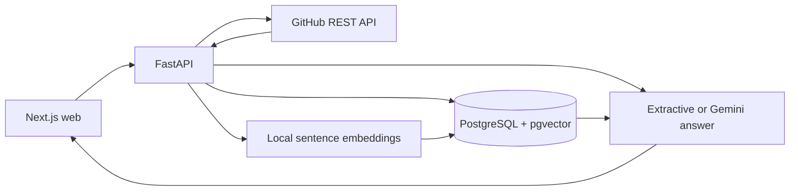

# RepoMind

RepoMind indexes a public GitHub repository and answers questions with links to the source lines used as evidence. It combines PostgreSQL full-text search with pgvector similarity, then reranks and packs the retrieved chunks before answering. The default local answer mode is extractive and needs no model API key. A Gemini provider can be enabled for prose answers.

See [implementation architecture](docs/ARCHITECTURE.md) and the [reference specifications](docs/spec/01-PRD.md).

## Architecture



The API stores repository snapshots, source files, chunks, ingestion jobs, and query sessions. A background job fetches a commit tree, filters unsupported files, chunks text with line ranges, embeds it, and writes the index. Re-indexing the same commit returns the existing snapshot. For a new commit, unchanged GitHub blob SHAs reuse stored content and vectors. Queries run dense and lexical searches independently, merge with reciprocal rank fusion, rerank, and validate citation IDs before returning an answer.

## Run locally

Requirements: Docker with Compose, Python 3.11, Node.js 22, and npm. The first ingestion downloads the configured Sentence Transformers model; allow network access and enough disk space for the model. Public GitHub ingestion works without a token but has a lower API rate limit.

1. Copy `.env.example` to `.env`. Keep real keys only in `.env` or deployment secrets.
2. Start the whole stack:

   ```bash
   docker compose up --build
   ```

3. Open `http://localhost:3000`. Paste a public `https://github.com/owner/repository` URL and index it. Ask a question after the job completes.

The API is at `http://localhost:8000/api/v1`; OpenAPI docs are at `http://localhost:8000/docs`. The API container runs the Alembic migration before starting. Database data lives in the `pgdata` Docker volume.

For host development, start only the database with `docker compose up -d db`, then:

```bash
python -m pip install -e "apps/api[dev,local]"
cd apps/api
alembic upgrade head
uvicorn repomind.api:app --reload
```

In another terminal:

```bash
cd apps/web
npm install
npm run dev
```

On Windows PowerShell, set environment values in the terminal or load them from `.env` before starting the host API. The Docker Compose setup passes the documented variables directly.

## Configuration

| Variable | Purpose | Default |
| --- | --- | --- |
| `DATABASE_URL` | PostgreSQL connection | local `repomind` database |
| `GITHUB_TOKEN` | Optional server-side token for higher GitHub rate limits | empty |
| `LLM_PROVIDER` | `extractive` or `gemini` | `extractive` |
| `LLM_API_KEY` | Gemini key; required only with `gemini` | empty |
| `LLM_MODEL` | Gemini model name | `gemini-2.5-flash` |
| `EMBEDDING_MODEL` | Local Sentence Transformers model | `all-MiniLM-L6-v2` |
| `EMBEDDING_DIM` | Must match the migration's vector dimension | `384` |
| `RERANKER_PROVIDER` | `token_overlap` or `cross_encoder` | `token_overlap` |
| `RERANKER_MODEL` | Local CrossEncoder model when enabled | `ms-marco-MiniLM-L-6-v2` |
| `CORS_ORIGINS` | Comma-separated allowed web origins | `http://localhost:3000` |
| `RATE_LIMIT_PER_MINUTE` | Per-process, per-IP POST limit | `30` |
| `MAX_FILES`, `MAX_FILE_BYTES`, `MAX_TOTAL_BYTES`, `MAX_CHUNKS` | Indexing bounds | see `.env.example` |
| `NEXT_PUBLIC_API_BASE_URL` | Browser API origin | `http://localhost:8000/api/v1` |

The first migration creates a `vector(384)` column and HNSW/GIN indexes. Change the migration and embedding model together if using another dimension. `/health/ready` reports a schema mismatch.

## API

| Method | Path | Purpose |
| --- | --- | --- |
| POST | `/api/v1/repositories/ingest` | Start a database-backed job |
| GET | `/api/v1/ingestion/{job_id}` | Read progress and errors |
| GET | `/api/v1/repositories/{repository_id}` | Repository metadata |
| POST | `/api/v1/repositories/{repository_id}/query` | Ask a grounded question |
| GET | `/api/v1/repositories/{repository_id}/sources/{source_id}` | Inspect bounded source lines |
| GET | `/api/v1/sessions/{session_id}` | Read recent conversation history |
| GET | `/api/v1/health/live`, `/api/v1/health/ready` | Health checks |

Errors contain a code, message, retryability flag, and request ID. Query responses include source links and retrieval counts. Enable `debug` in the query request to inspect top evidence paths and scores. Source text is rendered as plain text by the web client, never as executable code or trusted HTML.

## Test and evaluate

```bash
cd apps/api && pytest -q && ruff check . && mypy repomind --ignore-missing-imports
cd apps/web && npm test && npm run lint && npm run typecheck && npm run build
```

The API tests cover URL parsing, file filtering, deterministic chunks, GitHub tree handling, fusion, citation validation, ingestion idempotence, and database retrieval. CI starts pgvector, migrates from scratch, and runs these tests plus a browser workflow.

After indexing `prxns/RepoMind`, run `PYTHONPATH=apps/api python evals/run.py --k 5` from the repository root. This computes measured Recall@K, Precision@K, MRR, and nDCG for lexical, vector, hybrid, and hybrid-plus-reranking baselines. Results go to ignored `evals/results/` files. See [evaluation notes](evals/README.md).

## Deployment and limits

Deploy the web and API containers with a persistent PostgreSQL/pgvector service, run `alembic upgrade head` before serving traffic, and set explicit CORS and secrets. The in-process rate limit and background ingestion runner are suited to a single API process. For multiple API replicas, replace them with shared rate limiting and a durable worker while preserving the existing job table. Public repositories only; private OAuth, webhook sync, and repository code execution are out of scope. The default extractive mode surfaces evidence rather than synthesizing a prose explanation.

Screenshots may be added after a real capture under `docs/screenshots/`.
