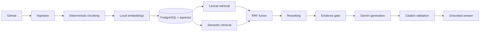
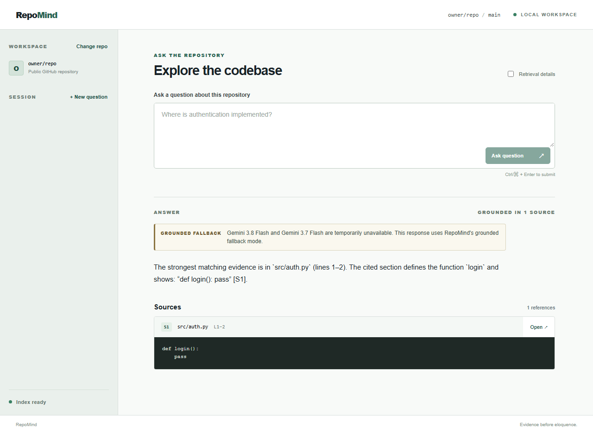

# RepoMind

RepoMind is a repository-aware RAG knowledge engine. It indexes a public GitHub
repository, retrieves relevant source with hybrid search, and answers questions
with links to the exact file and line ranges used as evidence. It is a developer
tool for understanding a codebase, not a general-purpose chatbot.

See the [implementation architecture](docs/ARCHITECTURE.md), the
[reference specifications](docs/spec/01-PRD.md), and the
[contribution and CI policy](CONTRIBUTING.md).

## Architecture


```mermaid
flowchart LR
  GitHub[GitHub] --> Ingest[Ingestion]
  Ingest --> Chunk[Deterministic chunking]
  Chunk --> Embed[Local embeddings]
  Embed --> DB[(PostgreSQL + pgvector)]
  DB --> Lexical[Lexical retrieval]
  DB --> Semantic[Semantic retrieval]
  Lexical --> RRF[RRF fusion]
  Semantic --> RRF
  RRF --> Rerank[Reranking]
  Rerank --> Gate[Evidence gate]
  Gate --> Gemini[Gemini generation]
  Gemini --> Validate[Citation validation]
  Validate --> Answer[Grounded answer]
```

The API stores repository snapshots, source files, chunks, ingestion jobs, and
query sessions. Re-indexing the same commit returns its completed snapshot. For a
new commit, unchanged GitHub blob SHAs reuse stored content and vectors. Query
retrieval runs pgvector cosine search and PostgreSQL full-text search
independently, combines candidates with Reciprocal Rank Fusion, reranks them,
and packs non-overlapping evidence within a bounded context budget.

Before generation, a deterministic evidence-sufficiency gate combines lexical
query-term coverage, dense similarity, lexical/dense rank agreement, reranker
overlap, and candidate concentration. A question with no meaningful repository
term match cannot pass on dense similarity alone. When the gate fails, RepoMind
returns:

> I don't have enough evidence in the indexed repository to answer that question.

No generation provider is called and the citation list is empty.

## Generation and fallback

```text
Gemini 3.8 Flash
        ↓
Gemini 3.7 Flash
        ↓
deterministic grounded fallback
```

With `LLM_PROVIDER=auto` and a configured server-side Gemini key, RepoMind makes
one bounded attempt with `gemini-3.8-flash`, then one with
`gemini-3.7-flash` after a safe, classified provider failure. It does not retry
either model indefinitely. HTTP 429, 500, 502, 503, and 504 responses, network
failures, and timeouts are treated as transient. Authentication, malformed
request, and invalid model errors are recorded as permanent configuration
failures and are not repeatedly retried.

Gemini uses the current Interactions API structured-output contract. The model
must return a JSON object containing an answer and citation IDs. RepoMind checks
that structure, removes any ID or inline citation marker not present in the
retrieved evidence, and constructs GitHub links only from stored source
metadata.

The final fallback is deterministic and is **not an LLM**. It selects concise
evidence lines using fixed rules and renders them with source paths, line ranges,
symbols where directly present, and citations. It requires no model API key,
local LLM, Ollama, GPU, or additional paid service.

The UI always shows the selected mode:

- primary AI answer: “Generated with Gemini 3.8 Flash.”
- fallback AI answer: the unavailable provider and the selected provider
- deterministic fallback: the failed hosted providers and grounded fallback mode
- insufficient evidence: a gate status with no provider call

These are neutral status notices; normal fallback is not rendered as an error.

## Run locally

Requirements: Docker with Compose, Python 3.11, Node.js 22, and npm. The first
ingestion downloads the configured Sentence Transformers model, so allow network
access and enough disk space. Public GitHub ingestion works without a token at a
lower API rate limit.

1. Copy `.env.example` to `.env`. Keep real keys only in that ignored file or
   a deployment secret store.
2. Choose a generation mode:

   - No Gemini key: set `LLM_PROVIDER=deterministic`.
   - Automatic hosted chain: set `LLM_PROVIDER=auto` and set
     `GEMINI_API_KEY`.

3. Start the local stack:

   ```bash
   docker compose up --build
   ```

4. Open `http://localhost:3000`, index a public
   `https://github.com/owner/repository` URL, and ask a repository question.

The API is at `http://localhost:8000/api/v1`; OpenAPI documentation is at
`http://localhost:8000/docs`. The API container applies Alembic migrations
before startup, and PostgreSQL data persists in the `pgdata` Docker volume.
Local Compose ports bind only to this computer.

For host development, start the database and install each application:

```bash
docker compose up -d db
python -m pip install -e "apps/api[dev,local]"
cd apps/api
alembic upgrade head
uvicorn repomind.api:app --reload
```

In another terminal:

```bash
cd apps/web
npm install
npm run dev
```

On Windows, use `127.0.0.1` instead of `localhost` in `DATABASE_URL` if the
local resolver tries IPv6 before Docker's IPv4-only port binding.

## Configuration

| Variable | Purpose | Default |
| --- | --- | --- |
| `DATABASE_URL` | PostgreSQL connection | local `repomind` database |
| `GITHUB_TOKEN` | Optional server-side token for GitHub rate-limit headroom | empty |
| `LLM_PROVIDER` | `auto`, `deterministic`, or legacy `extractive` alias | `auto` |
| `GEMINI_API_KEY` | Server-side Gemini credential | empty |
| `GEMINI_API_URL` | Gemini Interactions endpoint | `https://generativelanguage.googleapis.com/v1/interactions` |
| `GEMINI_PRIMARY_MODEL` | First hosted generation model | `gemini-3.8-flash` |
| `GEMINI_SECONDARY_MODEL` | Second hosted generation model | `gemini-3.7-flash` |
| `GEMINI_TIMEOUT_SECONDS` | Per-provider HTTP timeout | `45` |
| `EMBEDDING_MODEL` | Local Sentence Transformers model | `all-MiniLM-L6-v2` |
| `EMBEDDING_DIM` | Must match the migrated vector dimension | `384` |
| `RERANKER_PROVIDER` | `token_overlap` or `cross_encoder` | `token_overlap` |
| `RERANKER_MODEL` | Local CrossEncoder model when enabled | `ms-marco-MiniLM-L-6-v2` |
| `EVIDENCE_GATE_MIN_SCORE` | Minimum combined gate score | `0.30` |
| `EVIDENCE_GATE_MIN_SIGNALS` | Minimum independent passing signals | `2` |
| `EVIDENCE_GATE_MIN_QUERY_TERMS` | Minimum matched meaningful query terms | `1` |
| `EVIDENCE_GATE_MIN_LEXICAL_COVERAGE` | Lexical signal threshold | `0.20` |
| `EVIDENCE_GATE_MIN_DENSE_SIMILARITY` | Dense signal threshold | `0.25` |
| `EVIDENCE_GATE_MIN_RANK_AGREEMENT` | Retrieval agreement threshold | `0.20` |
| `EVIDENCE_GATE_MIN_RERANKER_OVERLAP` | Top-evidence overlap threshold | `0.20` |
| `CORS_ORIGINS` | Comma-separated allowed browser origins | `http://localhost:3000` |
| `RATE_LIMIT_PER_MINUTE` | Per-process, per-IP POST limit | `30` |
| `GLOBAL_RATE_LIMIT_PER_MINUTE` | Per-process POST limit across clients | `120` |
| `MAX_ACTIVE_INGESTIONS` | Database-wide queued/running indexing bound | `8` |
| `MAX_CONCURRENT_QUERIES` | Simultaneous queries per API process | `4` |
| `MAX_FILES`, `MAX_FILE_BYTES`, `MAX_TOTAL_BYTES`, `MAX_CHUNKS` | Ingestion bounds | see `.env.example` |
| `NEXT_PUBLIC_API_BASE_URL` | Browser-visible API origin; never a secret | `http://localhost:8000/api/v1` |

The gate thresholds are deliberately configurable. Higher values reduce
unrelated answers but can reject short symbol lookups; lower values improve
recall but increase the chance that a weak neighbor passes. The term-match and
multi-signal requirements prevent one high dense score from deciding alone.
Identifier tokenization and embedding calibration remain model- and
repository-dependent.

## Security

- Gemini and GitHub credentials are loaded only on the server from environment
  variables or deployment secret stores.
- `.env` and production environment files are ignored by Git. Committed
  examples contain empty placeholders only.
- No `NEXT_PUBLIC_*` variable contains a provider or GitHub secret.
- API responses and provider logs contain only safe failure categories, never
  authorization headers, keys, raw provider bodies, prompts, or repository
  context.
- Repository content, user questions, GitHub data, and model output are treated
  as untrusted. Ingestion never executes repository files.
- `python scripts/check_secrets.py` scans source and example environment files
  for common committed-secret patterns; CI runs the same check.

If a key may have been exposed elsewhere, rotate it at the provider. A clean
scan cannot prove a credential was never disclosed.

## API and observability

| Method | Path | Purpose |
| --- | --- | --- |
| POST | `/api/v1/repositories/ingest` | Start a database-backed job |
| GET | `/api/v1/ingestion/{job_id}` | Read progress and safe errors |
| GET | `/api/v1/repositories/{repository_id}` | Repository metadata |
| POST | `/api/v1/repositories/{repository_id}/query` | Ask a grounded question |
| GET | `/api/v1/repositories/{repository_id}/sources/{source_id}` | Inspect bounded source lines |
| GET | `/api/v1/sessions/{session_id}` | Read recent history |
| GET | `/api/v1/health/live`, `/api/v1/health/ready` | Health checks |

Query metadata records provider attempts, selected provider, fallback status,
safe failure categories, evidence-gate signals, retrieval latency, generation
latency, and total latency. Debug mode additionally returns top evidence paths
and scores. It does not record keys, authorization headers, raw provider errors,
full prompts, or full source context.

## Tests

```bash
cd apps/api
pytest -q
ruff check .
mypy repomind --ignore-missing-imports
python -m compileall -q . ../../evals

cd ../web
npm test
npm run lint
npm run typecheck
npm run build
npm run test:e2e

cd ../..
python scripts/check_secrets.py
docker compose config --quiet
```

Validate the standalone production file with the placeholder values described
in `.env.production.example`:

```bash
docker compose --env-file .env.production -f docker-compose.production.yml config --quiet
```

Provider tests inject deterministic HTTP failures; they do not repeatedly call
real Gemini endpoints.

## Evaluation

After indexing `prxns/RepoMind`, run from the repository root:

```bash
PYTHONPATH=apps/api python evals/run.py --k 5
```

The runner computes measured Recall@K, Precision@K, MRR, and nDCG at source-path
level for lexical, vector, hybrid, and hybrid-plus-reranking retrieval. It writes
JSON and Markdown to ignored `evals/results/` files. RepoMind does not ship
hardcoded benchmark claims; report results only from an actual indexed run. See
[evaluation notes](evals/README.md).

## Usage and cost

Local deterministic mode and local embeddings do not call a paid generation
provider. Gemini usage may fall within a provider free tier or may incur charges
depending on the account, region, model availability, quota, and billing
configuration. Enabling `GEMINI_API_KEY` is opt-in; RepoMind does not claim
hosted generation is always free.

## Deployment

`docker-compose.production.yml` is a standalone public deployment. It exposes
only an authenticated HTTPS Caddy gateway; PostgreSQL, the API, and the web
container have no host ports.

1. Copy `.env.production.example` to ignored `.env.production`.
2. Set a strong `POSTGRES_PASSWORD`; use its URL-encoded value in
   `DATABASE_URL` with host `db`.
3. Set `PUBLIC_DOMAIN`, `PUBLIC_ORIGIN`, and `BASIC_AUTH_USER`.
4. Generate `BASIC_AUTH_HASH` interactively with
   `docker run --rm -it caddy:2 caddy hash-password`.
5. Add `GEMINI_API_KEY` only if hosted generation is intended.
6. Validate and start:

   ```bash
   docker compose --env-file .env.production -f docker-compose.production.yml config --quiet
   docker compose --env-file .env.production -f docker-compose.production.yml up --build -d
   ```

Back up the `pgdata` volume and practice restoration before relying on the
deployment.

## Screenshots



The screenshot is captured from the local web application with mocked provider
failures and public example source; it contains no credential.

## Limitations

- Public GitHub repositories only; private OAuth and webhook sync are out of scope.
- Ingestion jobs run inside one API process. Multiple replicas need a durable
  worker and shared request limiter.
- The default vector schema is fixed at 384 dimensions; changing embedding
  dimensions requires a matching migration.
- The evidence gate is deterministic but heuristic. Very short identifiers,
  synonyms with no lexical overlap, or unusually calibrated embeddings can
  produce false abstentions or weak passes.
- Citation validation guarantees source identity and line ranges, not that every
  generated sentence is semantically correct. Users can inspect the source.
- Model availability, free-tier eligibility, billing, and regional access are
  controlled by the Gemini provider.
